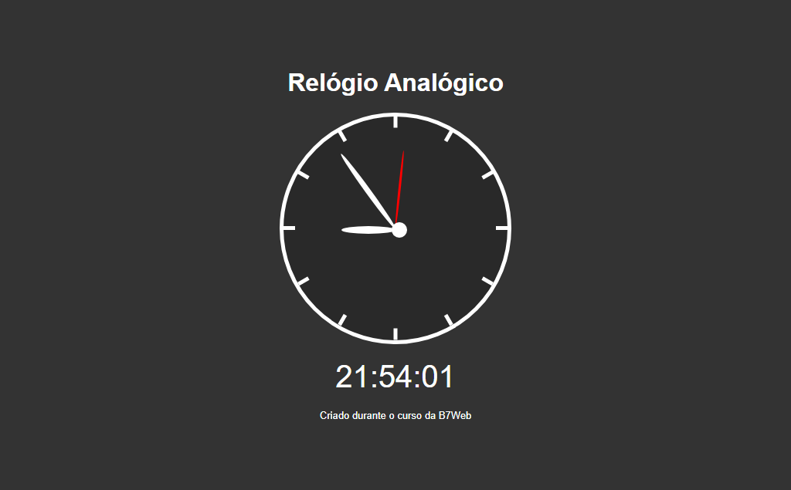

# Relógio Analógico

> Relógio

Esse é o projeto Relógio Analógico criado no curso da B7Web.

[Clique para acessar](https://guimiiller.github.io/relogio_analog/)

## 🚀 Tecnologias

- HTML
- CSS
- JavaScript
- Git e Github

## 💻 O que aprendi

- Aprendi a manipular as horas, minutos e segundos com JavaScript
- Aprendi a sincronizar o relógio digital com o analógico 

## 📨 Contato

- guilhermemillerblack@gmail.com